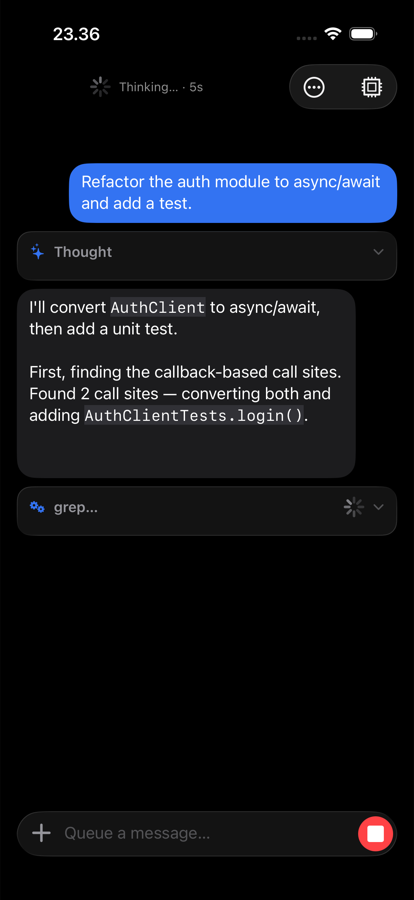
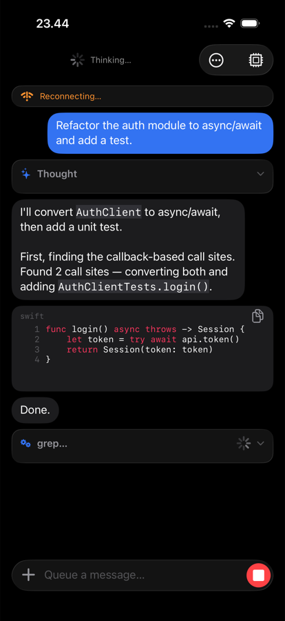

# Tailscode

**Drive your coding agents from your phone.** Tailscode is a native UIKit iOS client for remote coding agents — [opencode](https://opencode.ai) and **Claude Code** (via [claude-bridge](https://github.com/guitaripod/claude-bridge)) — reached over [Tailscale](https://tailscale.com). Send a prompt, pocket your phone, and follow the agent's progress from your Lock Screen.

Built on [CodingAgentKit](https://github.com/guitaripod/CodingAgentKit), a GPL-3.0 Swift package that unifies both backends behind one conversation engine. The app is a polished shell; the engine is reusable.

## Why

Coding agents run long turns on machines that aren't in front of you. Tailscode makes the phone the remote control: full streaming transcripts, tool-call visibility, permission approvals, and Live Activities — so "prompt and bounce" actually works.

<p align="center">
  
  &nbsp;&nbsp;
  
</p>

## Features

**Chat**
- Streaming transcripts with collapsible **thought + tool activity groups**, syntax-highlighted code blocks (horizontally scrollable, byte-exact copy), markdown rendering, and per-turn timestamps.
- **Optimistic sends** — your prompt echoes instantly, the thinking indicator engages in the same frame, and failures hand your text back instead of eating it.
- **Steering** — type while the agent runs to queue a follow-up; edit or cancel queued messages; stop button aborts server-side.
- **Inline permission approvals** — Allow once / Always / Deny cards in the transcript, with haptic + notification alerts.
- Slash-command palette (`/model`, `/fork`, `/usage`, `/clear`, …), message context menus (copy / quote / share), jump-to-message, regenerate, per-session composer drafts.
- **Model picker** with provider grouping, search, and recents; per-message model/effort overrides via long-press send. Claude reasoning-effort control.
- **Fork conversations** to explore alternate directions (Claude Code via claude-bridge).
- Session usage meter (tokens + cost), attachment support (photos, large-paste-as-file).

**Live Activities**
- Per-session Lock Screen + Dynamic Island activities with live phase (thinking / running tool / writing / awaiting approval), elapsed timer, and tool counts.
- Approval requests fire an ActivityKit alert; finished turns linger with the outcome.
- **Tap the activity to deep-link into that exact chat.** Completion/approval notifications deep-link too.

**Sessions & servers**
- Unified session list across **multiple servers**, grouped by machine, with live status pills, search (titles + directories), swipe actions, and context menus (new chat in the same project, …).
- Server-side **file browser** for picking a project directory (favorites + recents).
- **Tailnet discovery** — paste a Tailscale API token and Tailscode scans your devices for running agent servers.
- Connection health checks, auto-reconnect with resync-on-foreground, offline banners.

**Fit & finish**
- Liquid Glass (iOS 26) composer, FAB, and banners with material fallbacks; dark mode; Dynamic Type; haptics everywhere (toggleable).
- File-based diagnostics logger with an in-app colorized viewer.

## Requirements

- iOS 18+ (Liquid Glass effects appear on iOS 26+).
- A machine on your tailnet running one of:
  - `opencode serve` (port 4096)
  - [claude-bridge](https://github.com/guitaripod/claude-bridge) in front of Claude Code (port 4098)

## Build

The project is generated with [XcodeGen](https://github.com/yonaskolb/XcodeGen):

```bash
xcodegen generate
open Tailscode.xcodeproj
```

Set your own `DEVELOPMENT_TEAM` in `project.yml`. A built-in demo mode ("No server yet? Try the demo" on the connect screen, or the `--demo` launch argument) populates the whole app with two sample servers and scripted sessions — no tailnet needed. DEBUG builds auto-connect from `TAILSCODE_HOST` / `TAILSCODE_PASSWORD` environment variables.

`scripts/build-mac.sh` and `scripts/run-mac.sh` drive a remote Mac over SSH for author-on-Linux workflows.

## Architecture

```
Tailscode/
  App/           AppDelegate, SceneDelegate, AppCoordinator (routing + deep links)
  DesignSystem/  Theme — colors, spacing, typography, haptics, Liquid Glass helpers
  Logging/       AppLogger → OSLog + rotated file (Library/Logs/tailscode.log)
  Connection/    ConnectionController, tailnet discovery, manual connect
  Onboarding/    First-run connect flow with live probing
  Sessions/      Cross-server session list, file browser, background session monitoring
  Chat/          ChatViewController + ViewModel, composer, cells, model picker, slash palette
  LiveActivity/  AppActivityController (per-session activities, serialized updates)
TailscodeWidget/ ActivityKit widget (Lock Screen + Dynamic Island)
```

All networking, streaming, and state live in [CodingAgentKit](https://github.com/guitaripod/CodingAgentKit); the app renders `ConversationState` and forwards intent. If a capability is missing, it's added to the Kit — the app stays thin.

## Related projects

| Repo | What |
|---|---|
| [CodingAgentKit](https://github.com/guitaripod/CodingAgentKit) | The engine: Swift 6 package (GPL-3.0), Linux + Apple, unified opencode/Claude Code client, SSE streaming, `MessageReducer`, mockable backends, scriptable CLI |
| [claude-bridge](https://github.com/guitaripod/claude-bridge) | Hummingbird server that exposes Claude Code (`claude -p` stream-json) as structured HTTP sessions with SSE, forking, and usage |

## License

[GPL-3.0](LICENSE)
