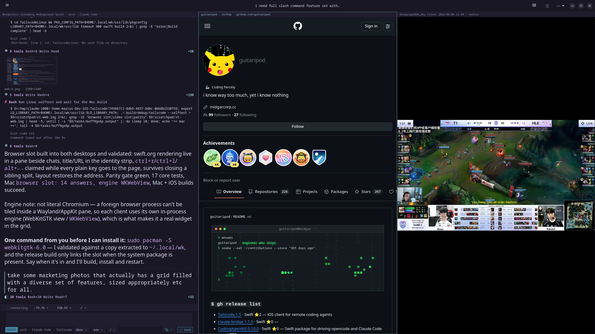
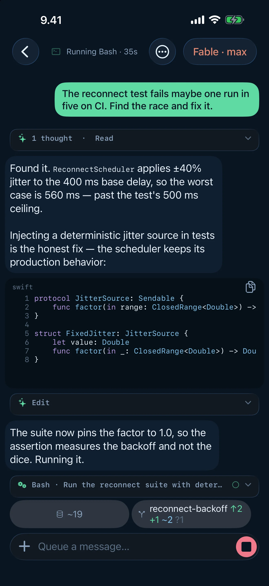
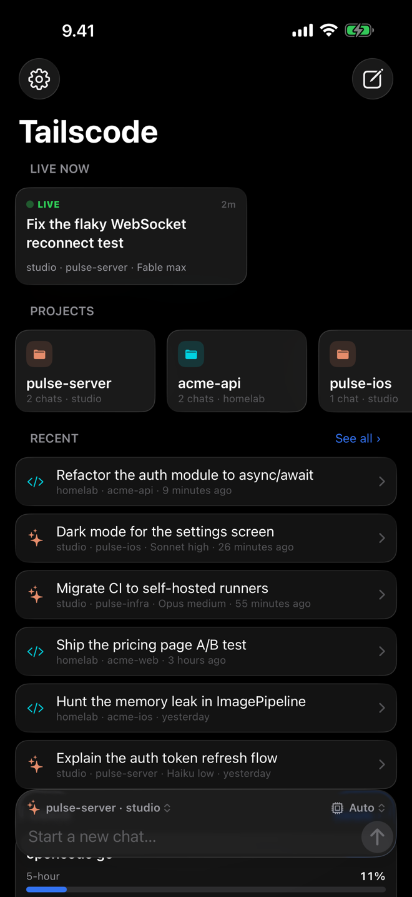
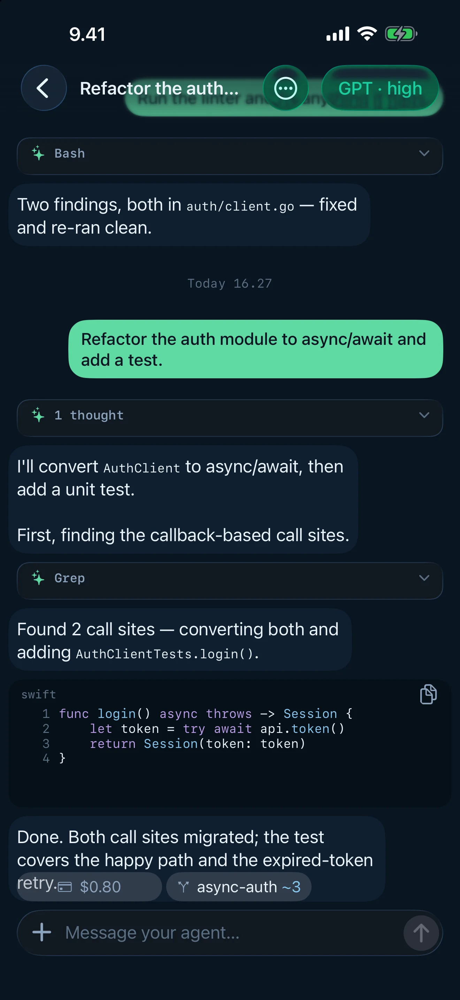
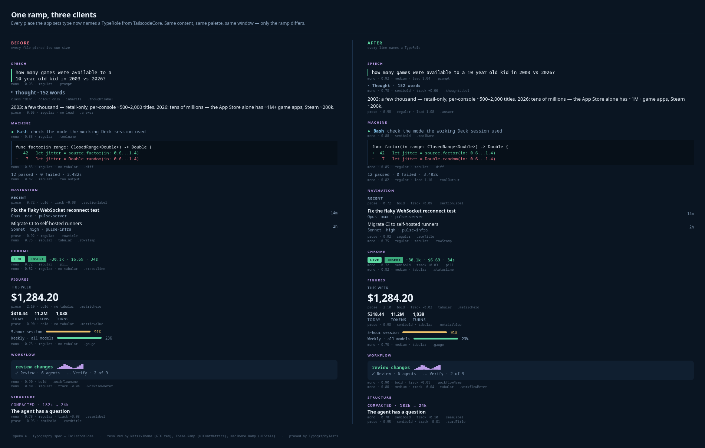

# Tailscode

**One product, three native clients, parity enforced by the compiler.** Tailscode is an iPhone app (UIKit), a macOS app (AppKit) and a Linux app (GTK4 + libadwaita), built from one shared Swift core — no cross-platform framework, no web view, no lowest common denominator. Every user-facing capability is a case in a registry, and every client has to answer every case before it will compile.

Those clients drive remote coding agents — [opencode](https://opencode.ai) on port 4096, **Claude Code** via [claude-bridge](https://github.com/guitaripod/claude-bridge) on port 4098, and **Oh My Pi** via [omp-bridge](https://github.com/guitaripod/omp-bridge) on port 4099 — running on machines you own. The app talks to them point-to-point over your own [Tailscale](https://tailscale.com) tailnet. No relay, no account, no vendor backend: there is no server of ours in the path, because there is no server of ours. The transport's security is Tailscale's WireGuard, not something Tailscode implements.

<p align="center">
  <a href="https://apps.apple.com/app/tailscode/id6791660932"><b>iPhone &amp; Mac — App Store</b></a> ·
  <a href="https://aur.archlinux.org/packages/tailscode"><b>Linux — AUR</b></a> ·
  <a href="https://github.com/guitaripod/Tailscode/releases"><b>Linux — release tarball</b></a> ·
  <a href="https://midgarcorp.cc/tailscode">midgarcorp.cc/tailscode</a> ·
  <a href="LICENSE">GPL-3.0</a>
</p>

Latest releases: **iPhone 1.23** · **macOS 1.22** · **Linux 1.24** (the 1.24 iPhone and Mac builds are in App Review). The apps are free; a one-time **$14.99 Pro** non-consumable unlocks unlimited servers and concurrent Live Activities on both iPhone and Mac. iPhone only — there is no iPad build.

Built on [CodingAgentKit](https://github.com/guitaripod/CodingAgentKit), a GPL-3.0 Swift package that unifies both backends behind one conversation engine. The clients are polished shells; the engine is reusable.

## Why

Coding agents run long turns on machines that aren't in front of you. The phone is the remote control — full streaming transcripts, tool-call visibility, permission approvals, and Live Activities — so "prompt and bounce" actually works. The desktops are the multi-pane workspace: tiled chats, a terminal and file tree beside them, optional browser and video slots, vim in the composer.

<p align="center">
  
</p>

<p align="center">
  
  &nbsp;
  
  &nbsp;
  
</p>

## Parity is a build gate

Most cross-platform claims are a promise. This one is a switch statement.

`TailscodeCore/Sources/TailscodeCore/Parity.swift` declares `AppCapability` — **150 cases**, one per user-facing capability — plus a registry entry per case describing the capability in toolkit-free prose, so a port is judged against semantics rather than a screenshot.

Each client ships a manifest that switches over `AppCapability` **exhaustively, with no `default`**:

- `Tailscode/App/Parity.swift`
- `TailscodeMac/Parity.swift`
- `TailscodeLinux/Sources/TailscodeLinux/Parity.swift`

Adding a capability in Core is therefore a **compile error in all three clients** until each one says what it does about it. Five answers are allowed:

| Answer | Means |
|---|---|
| `.implemented("Anchor")` | Done here. `Anchor` is a type or function name that must exist **in this client's own tree** |
| `.partial("Anchor", missing: "…")` | Shipped, with named work still owed |
| `.gap("…")` | Not done, and the reason says what is actually in the way |
| `.notApplicable("…")` | A considered decision that the capability is meaningless on this platform |
| `.varies(direct:appStore:because:)` | The client ships two ways and the two answers differ — Mac only |

The Mac client ships twice: the ad-hoc build a person installs themselves, and the sandboxed one the App Store hands out, which is a smaller app on purpose. So the matrix has **four columns** — `iOS`, `linux`, `mac`, `mac-store` — and the last two read the same manifest, resolving a `.varies` to their own half.

`scripts/parity.sh` re-derives the case list from Core, rejects any `default:`, demands an answer for every case, refuses an empty reason on any non-`implemented` answer, and greps each claimed anchor inside **that client's own directory only** — shared code existing in the Kit proves nothing about who wired it. The anchor grep is distribution-aware: `scripts/lib/gating.awk` reads the source the way the compiler does, honouring `#if TAILSCODE_MAS` frames, so an anchor the store build compiles out cannot be claimed by the store column. `scripts/parity-hook.sh` runs it as a Claude Code Stop hook, so an agent cannot end a turn on an invalid manifest, and the two desktop clients assert the same invariants at runtime under `--selftest`.

```
$ ./scripts/parity.sh
capability                 iOS         linux       mac         mac-store
----------                 ---         -----       ---         ---------
sessionSections            ok          ok          ok          ok
...
434/488 implemented, 12 partial, 12 gaps, 30 n/a
PARITY_OK
```

The interesting answers:

- **What a phone has nowhere to put** — the desktop tiling family (`splitPanes`, `terminalPane`, `browserSlot`, `videoSlot`, `vimComposer`, `summonAnywhere`, `newPaneChooser`, …) is `.notApplicable` on iOS, and Linux opts out of the Apple-owned surfaces (`hapticFeedback`, `usageWidgets`, `homeQuickActions`, `gameCenter`).
- **The Mac's halves differ** — the store copy loses what the sandbox forbids (tailnet discovery, the watch-sites board) and gains what only the store can do (Game Center authentication, installing the app itself). The ad-hoc copy has no Game Center entitlement and cannot rebuild the `.app` it is running out of, so its update centre hands over the build command instead.
- **`auroraStream` is the one thing iOS alone has** — the GPU-written streaming answer. Linux would need to take the drawing away from Pango, and the Mac would need a glyph mapper against `NSLayoutManager`; both desks use the settled renderer until then, losing no meaning.
- `linkEmbeds` and `reviewPrompt` are desktop gaps with the work named: preview cards for transcript links, and a Mac review-prompt coordinator riding the same turn-completion signal iOS hooks.

Be clear about what this buys: exhaustiveness forces **disclosure**, not implementation. `.gap("later")` compiles. What the gate guarantees is that no capability can quietly exist on one platform while the others say nothing, and that every exception is a paragraph somebody had to write and defend.

## What it does

**Delegate** (Pro on iPhone and Mac)
- **A packet goes down the ladder, a verified patch comes back.** Each server can run the [`delegate`](https://github.com/guitaripod/delegate) daemon beside its agent: write a goal, the paths the worker may touch and the command that judges it, pick how far up the tier ladder it may climb, and watch a local or cheap-cloud model try it in an isolated worktree — every attempt verified, failures escalated with the verifier's own words, the passing patch applied unstaged. The board shows each machine's tiers and what answers there, every run as a story with its ladder, and a pass-rate table whose promotion hints are streaks, never feelings. A gated rung waits for your approve or hold. The demo world carries a scripted dispatcher, so all of it can be tried before you own a machine.

**Chat**
- Streaming transcripts with collapsible **thought + tool activity groups**, syntax-highlighted code blocks (~60 languages, one toolkit-free lexer, byte-exact copy), real **markdown tables**, tappable links, and per-turn timestamps.
- **The answer is written, not pasted** — streamed prose plays out of a buffer at an evenly adapting pace, held at the last markdown-safe position so nothing flashes its asterisks, laid out once so no line ever re-wraps under the reader, with a heat-and-shimmer wave riding the newest characters at up to 120 Hz. iOS has a second renderer that hands the glyphs to the GPU; which hand writes is a setting you can watch change.
- **Optimistic sends** — your prompt echoes instantly, the thinking indicator engages in the same frame, and failures hand your text back instead of eating it. Type while the agent runs to queue a follow-up; edit or cancel queued messages; stop aborts server-side.
- **Inline permission approvals** — Allow once / Always / Deny cards in the transcript; an approval answered on another device clears everywhere.
- **Answerable questions** — an agent's `AskUserQuestion` becomes a real form docked at the end of the transcript: single- and multi-select, a line to type an answer on, skip.
- **Subagents render in place** — a spawned agent expands as a card at its own tool call; a wide fan-out collapses behind one row. A **task board** folds the agent's todo calls into one live checklist, and a **workflow card** shows a multi-agent run as phases with live agent rows.
- **Pictures the agent looked at** — every tool result that handed the model an image docks as an image bubble; tapping opens a paged gallery over every picture in the conversation, zoomable to 1:1, exporting the server's original bytes.
- **Compaction is a seam you can read** — `/compact` opens a preflight (it is irreversible and takes minutes) and lands as a divider showing what was traded for what, with the full summary behind it in a reader.
- **Diffs wear their language** — edit-tool calls and git patches get add/remove line washes with the code's own syntax colouring on top.
- **A turn that produced nothing says so**, and an interrupted one is marked as interrupted rather than left looking finished. A finished answer can report what it took: duration, tokens, throughput.
- Find in transcript, jump-to-message, fork a conversation, save a full local snapshot that still opens when the server is gone, per-session **drafts** persisted per keystroke.
- Slash commands with two halves done right: completion ranked over the **server's own catalog** while you type, and a typed command dispatched exactly as a picked one would be. The whole catalog is also **browsable**.
- Attachments: photos, files, and a clipboard that's read for what it is — copied files become chips, a picture becomes a chip, an overlong paste becomes a file, only words insert at the caret.
- **Prompt enhance** (iPhone) — hold Send to rewrite a rough prompt on-device with Apple's Foundation Models. Requires iOS 26; nothing leaves the phone.

**Models and money**
- **One model chooser over every server** — every provider's models in family sections, searchable, duplicate offers folded into one row with alternates, capabilities on the row, recents. The catalog is watched live, so models added by a server restart appear without relaunching.
- **Model identity tint** — every model family wears an authored hue and every effort level its heat, on chat rows, composer chips and effort controls. **Ultracode wears a rainbow.**
- **Quota walls, scoped** — exhaustion is a clear state with a one-shot alert and a chrome notice scoped to the chat's own provider; spent models draw dimmed-but-pickable in the chooser.
- **Session spend** — the chat's chrome carries what the whole conversation has cost, and touching it opens the account: per-turn bars, the four token tiers, per-model shares, the five priciest turns. Priced from the CLI's own transcript, **always marked an estimate**.
- **Usage analytics** — the month in numbers, merged across every connected server: daily bars, the week's rhythm, the day's clock, models, projects, tools, what caching saved, records, insights. A DeepSeek prepaid **balance** is read as money, not a bar.
- **Game Center trophies** (Apple clients) — the same ledger scored against a trophy catalog with achievements and leaderboards; sign-in is lazy and never a wall.

**Git — read, never operated**
- The conversation's repository: branch and upstream drift, triage-ordered sections (conflicts, staged, changed, untracked), per-path status letters, half-done merges named, per-file diffs — and a shorthand chip on the chat's chrome (`↑↓ ✖ + ~ ?`) read without opening it. Tailscode performs no git write operations of any kind: no stage, no commit, no branch, no push.

**Search**
- **Cross-server transcript search** — one query fans out to every connected machine's full CLI transcript history (subagents included) and merges into one ranked list with quoted matches.

**Sessions and servers**
- Unified session list across **multiple servers**, grouped by machine, with live status pills, search, swipe actions, context menus — and a busy row's second line naming the work actually in flight.
- **Pin** the chats that matter, **archive** device-locally, select several and act on all of them in one gesture. **Project boards** open a project as its own scoped list.
- **Tailnet radar** — the app asks the tailnet's own peers on both agent ports and draws the sweep; machines hold fixed bearings, configured ones say so, and a credential is asked for only where the tailnet can't be read locally.
- **A signed-out Claude is a state, not a reply** — the app shows the machine's account as a banner, and signing in splits the browser flow across the two machines: the server hands over the URL, this device opens it and returns the code. Never "open a terminal".
- **Updates are standing facts** — the app and every server report what they run and what they could run; one still mark in the chrome until each update is taken, one press installing a bridge end to end through its own restart, and the one-line install command handed over when a machine can't update itself. A Linux package install reads the project's release feed itself and hands over your package manager's command when a newer release exists. A server can also be **restarted** from the app, and set to update itself.
- First run is a checklist the app verifies, not a form — live tailnet status, both ports probed, every failure named with the one tap that fixes it.

**Quick ask**
- One gesture opens a bare composer aimed at your default server — starters, recents, slash commands, an effort control, attachments, and a draft that outlives the surface. On iPhone it's in the icon's jump list and a Control Center tile; on the desktops a **global chord** (default Ctrl+Alt+A, recorded by pressing it, refused by name when it would break something else) summons it from any program.

**Themes and type**
- **Eight themes, two faces each** (Rosé Pine, Tokyo Night, Everforest, Gruvbox, Nord, Solarized, Suomi, Phosphor), authored for beauty and published through an OKLab contrast pass that fails the build rather than shipping an unreadable palette. The Apple clients also offer — and default to — **System**.
- **One typography ramp** — every piece of type names a role that carries face, weight, tracking, leading and digit width; the prompt is the heavier voice, the answer the lighter one, and a changing number is always tabular.

<p align="center">
  
</p>

**Home board** (iPhone)
- A board, not a server list: what's **live now**, the projects you work in, recent chats with unread badges, and your plan gauges — refreshed while you look at it. A **docked composer** starts a chat before one exists: pick project, server, model and effort, type, send.
- The app icon's jump list (New Chat, Saved, Usage, Quick Ask, a dynamic Resume) and a **missed-activity inbox** that keeps every alert listed until you've looked at it.

**Desktop workspace** (Linux and Mac)
- **Tiling splits** with vim-grade pane verbs, zoom, an even grid for a marked set of chats, and drag-a-chat-into-a-pane with a live preview. An empty pane asks which server, then which chat. The layout — including what a browser or video slot was showing — survives restarts.
- Panes beyond chat: a **terminal**, a **file tree**, a **browser slot** (the platform's own engine, claiming only browser chords), and a **video slot** (libmpv on Linux, AVKit on Mac) whose empty state is a board of what's live on your followed channels.
- **Where you press is what you're working in** — clicks route from the window itself, so focus follows intent without stealing the press's meaning.
- Rebindable **shortcut registry** with contexts, sequences, conflict reporting, and a cheatsheet derived from the effective bindings.

**Live Activities and notifications** (iPhone)
- Per-session **Lock Screen** and Dynamic Island activities with live phase (thinking / running tool / writing / awaiting approval), elapsed timer and tool counts.
- claude-bridge pushes updates over APNs, so the Lock Screen keeps ticking while the app is suspended. **Plain opencode has no push path** — against a bare `opencode serve`, an activity updates while the app can run, not from the server. Approval requests alert; finished turns linger with the outcome.
- **Tap to deep-link into that exact chat.** Every notification type is individually switchable.

**Widgets** (iPhone and Mac)
- Quota widgets in every size — small, medium, large, and the iPhone's **Lock Screen** rectangular, circular and inline accessories — plus Control Center controls for usage and Quick Ask. Providers, rows, detail level, accent and reset clock are configurable per widget.
- An app group and keychain access group let the timeline fetch Claude and Grok numbers itself, so the reading refreshes without opening the app. `TailscodeMacWidget/` puts the same reading in Notification Center.

**Fit and finish**
- Liquid Glass (iOS 26) composer, FAB and banners with material fallbacks; Dynamic Type; localized into **ten languages** (de, en, es, fr, it, ja, ko, pt-BR, zh-Hans, zh-Hant).
- **Haptics with meaning** (iPhone) — named cues led by the waiting group (send, step, needs-you, received), authored to stay pleasant at full strength, all scaled by one intensity slider that plays every stop it passes.
- **Presence orb** — alpha, opt-in, off by default, and it tells you it costs battery when you turn it on. A small GPU-rendered creature that breathes for work, knocks when something needs you, and holds still for failure.
- File-based diagnostics logger with an in-app colorized viewer and a shareable report.

## Clients

| Client | Toolkit | Floor | Source |
|---|---|---|---|
| **iPhone** | UIKit, programmatic. No SwiftUI in the app target (only in the widgets, which WidgetKit requires) | iOS 18; Liquid Glass and prompt enhance need iOS 26 | `Tailscode/` |
| **macOS** | AppKit. Carbon for the global hotkey, WebKit, GameKit, MetalKit | macOS 26 | `TailscodeMac/` |
| **Linux** | GTK4 + libadwaita through C shims. VTE, libmpv and WebKitGTK compiled in only if their headers exist | GTK 4.12 / libadwaita 1.4 | `TailscodeLinux/` |
| **Shared core** | Foundation only. Zero UIKit, AppKit, GTK or SwiftUI imports | Swift 6 language mode | `TailscodeCore/` |

The shared core carries 61 test files with **860 `@Test` functions** (swift-testing) — themes and the type ramp fail the build rather than drift. There is no UI test target on any client: the desktops prove their renderings end to end under `--selftest` (both suites include the parity check), and the iPhone client's exhaustiveness gates its compilation instead.

## Requirements

- **iPhone** — iOS 18+. iPhone only (`TARGETED_DEVICE_FAMILY 1`); there is no iPad build.
- **macOS** — 26+.
- **Linux** — **GTK 4.12+ and libadwaita 1.4+**. Ubuntu 24.04, Debian 13, Fedora 40 and Arch all clear it; **Ubuntu 22.04 and Debian 12 do not**. Optional VTE, mpv and WebKitGTK add the terminal, video and browser panes.
- **Tailscale** on this device and on the machine the agent runs on. Tailscode does not ship a transport of its own and does no relaying; if the two machines cannot see each other on the tailnet, there is nothing to fall back to.
- A machine on that tailnet running one of:
  - `opencode serve` (port 4096) — one command sets it up as a service and keeps its model list current, which a long-lived opencode server does not do on its own:

    ```bash
    curl -fsSL https://raw.githubusercontent.com/guitaripod/Tailscode/master/scripts/opencode-serve-install.sh | bash
    ```

  - [claude-bridge](https://github.com/guitaripod/claude-bridge) in front of Claude Code (port 4098). This is also what makes Live Activity pushes possible.
  - [omp-bridge](https://github.com/guitaripod/omp-bridge) in front of [Oh My Pi](https://github.com/can1357/oh-my-pi) (port 4099). Same wire protocol as claude-bridge, so every surface works unchanged — and the whole Oh My Pi provider catalog (Ollama Cloud, OpenCode Go, OpenRouter, Anthropic, xAI, DeepSeek, local ollama) lands in the model picker, filterable by provider.

## Install

### iPhone and Mac

[App Store](https://apps.apple.com/app/tailscode/id6791660932) — one purchase covers both platforms. Free is one server; Pro is a one-time $14.99 non-consumable for unlimited servers and concurrent Live Activities.

The repo can also build the Mac app yourself, ad-hoc signed and not sandboxed:

```bash
scripts/install-macapp.sh            # xcodegen + xcodebuild -scheme TailscodeMac -configuration Release
scripts/install-macapp.sh --launch   # and open it
```

That replaces `/Applications/Tailscode.app`. Ad-hoc signing is why this copy cannot authenticate Game Center and why its update centre hands you a build command instead of updating itself — the store copy does both.

### Linux

**Arch** — [tailscode](https://aur.archlinux.org/packages/tailscode) builds the current release from the `v1.24` tag; [tailscode-git](https://aur.archlinux.org/packages/tailscode-git) tracks master:

```bash
paru -S tailscode        # or yay, or: git clone the AUR package and makepkg -si
```

**Everyone else** — the release tarball from [GitHub releases](https://github.com/guitaripod/Tailscode/releases). It is one static-stdlib binary plus its desktop entry, icons, man page and completions, built in CI on `ubuntu-24.04` under `swift:6.2-noble`; the job fails if the binary needs anything newer than `GLIBC_2.39`, or if the VTE/mpv/WebKit headers are missing, so a release never silently drops a pane. **x86_64 only** — no aarch64 build is published.

```bash
tar xf tailscode-1.24-linux-x86_64.tar.gz -C ~/.local --strip-components=2
```

`--strip-components=2`, not 1: the archive members are `./usr/bin/tailscode`, so stripping one level lands the binary at `~/.local/usr/bin`.

Installed either way, the app checks the project's release feed itself and lights the update mark in its own chrome when a newer release exists. It never installs the update itself: the card spells out the whole procedure for the way this copy was installed — `paru -Syu tailscode` or `yay -Syu tailscode` from the AUR, `flatpak update io.github.guitaripod.Tailscode` for a Flatpak, the release page for a tarball — then quit and reopen Tailscode, because a package manager replaces the file and not the program still running from it.

A Flatpak manifest (`packaging/flatpak/`) is in the repo but **not published** — Tailscode is not on Flathub. Build it from the manifest if you want the sandbox.

**Steam Deck** — Desktop Mode, install from the tarball or a locally built Flatpak, then add it to Steam so it appears in Game Mode. Tailscale itself is a system service and cannot be a Flatpak; install it with the [deck script](https://github.com/tailscale-dev/deck-tailscale) first. The app is at its best docked to a monitor with a keyboard: Game Mode's on-screen keyboard cannot type into GTK text fields ([Valve bug](https://steamcommunity.com/app/1675200/discussions/1/3370405364916738938/)).

First run checks what it can: whether this machine is on a tailnet, and which machines on it are already answering — pick one from the scan and there is nothing to type.

## Build

**iOS** — generated with [XcodeGen](https://github.com/yonaskolb/XcodeGen):

```bash
xcodegen generate
open Tailscode.xcodeproj    # scheme Tailscode, iOS 18+
```

Set your own `DEVELOPMENT_TEAM` in `project.yml`. Demo mode ("Try the demo" on first run, or `--demo`) populates scripted servers with no tailnet — the same world on iPhone, Linux and Mac. DEBUG builds auto-connect from `TAILSCODE_HOST` / `TAILSCODE_PASSWORD`.

**Linux** — from a clean clone, with a Swift 6.2 toolchain (the manifests declare tools 6.0; CI builds on 6.2):

```bash
# Arch
sudo pacman -S --needed gtk4 libadwaita glib2 gdk-pixbuf2 libepoxy vte4 mpv webkitgtk-6.0 curl
# Debian, Ubuntu
sudo apt install libgtk-4-dev libadwaita-1-dev libgdk-pixbuf-2.0-dev libepoxy-dev \
    libvte-2.91-gtk4-dev libmpv-dev libwebkitgtk-6.0-dev

TAILSCODE_KIT_REMOTE=1 scripts/package-linux.sh build             # static-stdlib binary
TAILSCODE_KIT_REMOTE=1 scripts/package-linux.sh install <destdir>  # full install tree
TAILSCODE_KIT_REMOTE=1 scripts/package-linux.sh tarball            # release artifact
tailscode --selftest                                               # headless end-to-end check
```

The manifests use CodingAgentKit from a sibling checkout when there is one and from its published tag otherwise, so a clone builds without arranging anything.

**macOS** — `scripts/install-macapp.sh` on the Mac itself, as above. Design contract in `TailscodeMac/AGENTS.md`.

| Script | What |
|---|---|
| `scripts/parity.sh` | Capability matrix + anchor greps across all four columns (three clients, two Mac distributions). `--check` is the gate |
| `scripts/lib/gating.awk` | Reads a source file the way the compiler does, honouring `#if TAILSCODE_MAS`, so the store column cannot claim an anchor it compiles out |
| `scripts/parity-hook.sh` | The same gate, wired as a Claude Code Stop hook |
| `scripts/package-linux.sh` | Linux build / install tree / release tarball |
| `scripts/install-linuxapp.sh`, `scripts/dev-linuxapp.sh` | Linux dev loop: rebuild against a sibling Kit and restart; headless harness display |
| `scripts/install-macapp.sh` | Build TailscodeMac Release and replace `/Applications/Tailscode.app` |
| `scripts/build-macapp.sh` | From Linux: rsync to a Mac over Tailscale, Debug build, run `TailscodeMac --selftest` as the proof |
| `scripts/build-mac.sh`, `scripts/run-mac.sh` | From Linux: build the **iOS** app on a remote Mac for the Simulator, install it, take screenshots |
| `scripts/release.sh`, `scripts/release-mac.sh` | Archive + upload iOS / macOS App Store builds through the stable-macOS build VM |
| `scripts/asc-*.py` | App Store Connect suite: releases, notes, screenshots, products, Game Center |

## Architecture

```
TailscodeCore/       Shared, toolkit-free: parity registry, themes + typography, cascade
                     streaming, activity + presence, spend + analytics + trophies, git,
                     model fleet + quotas, splits + pane targets, slash + shortcuts,
                     quick ask + summon, update ledger, stores, demo world
  Tests/             61 files, 860 @Test functions (swift-testing)
Tailscode/           iPhone UIKit client — connection, chat, home board, usage, settings,
                     Live Activity + widgets, push
TailscodeMac/        AppKit client — tiling, Liquid Glass, Metal presence orb, SelfTest
TailscodeLinux/      GTK4 client — a SwiftPM package (C shims for adw, vte, mpv, WebKit)
TailscodeWidget/     ActivityKit widget (Lock Screen + Dynamic Island), quota widgets, controls
TailscodeMacWidget/  Mac quota widget
TailscodeNSE/        Notification service extension (push-driven widget reloads)
packaging/           Flatpak manifest, Arch PKGBUILDs, desktop entry, icons, metainfo
scripts/             Parity gate, packaging, dev loops, App Store Connect, film rig
```

All networking, streaming and state live in [CodingAgentKit](https://github.com/guitaripod/CodingAgentKit) (resolved from its published tag, 0.20.0 at the time of writing); the app renders `ConversationState` and forwards intent. If a capability is missing, it's added to the Kit — the app stays thin.

## Related projects

| Repo | What |
|---|---|
| [CodingAgentKit](https://github.com/guitaripod/CodingAgentKit) | The engine: Swift 6 package (GPL-3.0), Linux + Apple, unified opencode/Claude Code client, SSE streaming, `MessageReducer`, mockable backends, scriptable CLI |
| [claude-bridge](https://github.com/guitaripod/claude-bridge) | Hummingbird server that exposes Claude Code (`claude -p` stream-json) as structured HTTP sessions with SSE, subagents, compaction, spend, analytics, git, and APNs pushes |
| [omp-bridge](https://github.com/guitaripod/omp-bridge) | The same wire protocol over Oh My Pi (`omp --mode rpc`): sessions, streaming, ask dialogs, subagents, spend and analytics read from omp's own transcripts, self-update |

## License

[GPL-3.0](LICENSE)
