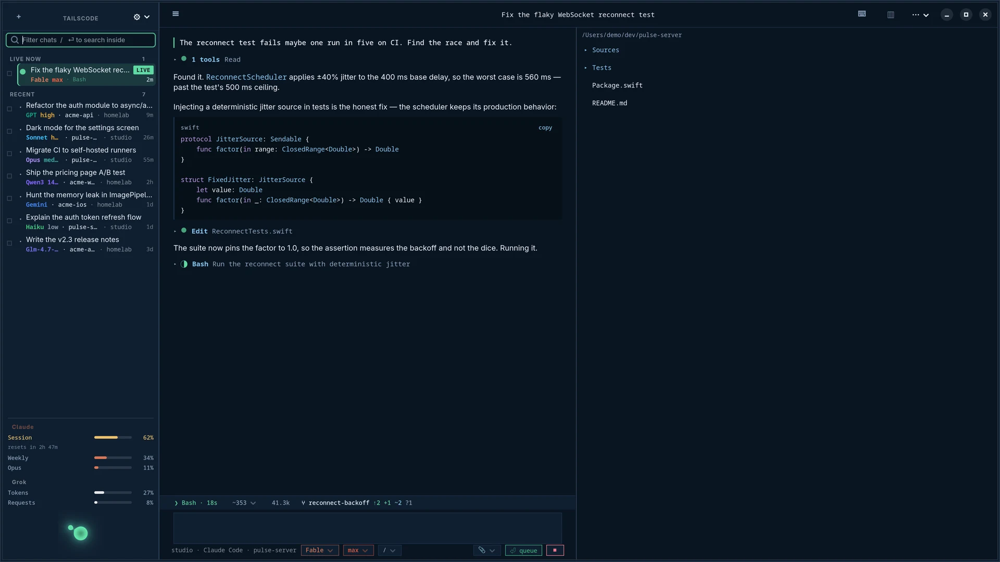

# Tailscode

**Drive your coding agents from every seat.** Tailscode is three native clients for remote coding agents — [opencode](https://opencode.ai) and **Claude Code** (via [claude-bridge](https://github.com/guitaripod/claude-bridge)) — reached over [Tailscale](https://tailscale.com): **iOS** (UIKit), **Linux** (GTK4), and **macOS** (AppKit, Liquid Glass). One conversation engine, one shared core (`TailscodeCore`), feature parity enforced by a capability registry.

<p align="center">
  <a href="https://apps.apple.com/app/tailscode/id6791660932"><b>Download on the App Store</b></a> · free, with a one-time Pro unlock · <a href="https://midgarcorp.cc/tailscode">midgarcorp.cc/tailscode</a> · <a href="LICENSE">GPL-3.0</a>
</p>

Built on [CodingAgentKit](https://github.com/guitaripod/CodingAgentKit), a GPL-3.0 Swift package that unifies both backends behind one conversation engine. The clients are polished shells; the engine is reusable.

## Why

Coding agents run long turns on machines that aren't in front of you. The phone is the remote control — full streaming transcripts, tool-call visibility, permission approvals, and Live Activities — so "prompt and bounce" actually works. The desktops are the multi-pane workspace: tiled chats, a terminal and file tree beside them, optional browser and video slots, vim in the composer.

<p align="center">
  
  &nbsp;
  
  &nbsp;
  
</p>

<p align="center">
  
</p>

## Features

**Home**
- A board, not a server list: what's **live now**, the projects you work in, recent chats with unread badges, and your plan gauges — refreshed while you look at it.
- A **docked composer** starts a chat before one exists: pick project, server, model and effort, type, send.
- The app icon's jump list (New Chat, Saved, Usage, Quick Ask, a dynamic Resume) and a **missed-activity inbox** that keeps every alert listed until you've looked at it.

**Chat**
- Streaming transcripts with collapsible **thought + tool activity groups**, syntax-highlighted code blocks (~60 languages, one toolkit-free lexer, byte-exact copy), real **markdown tables**, tappable links, and per-turn timestamps.
- **The answer is written, not pasted** — streamed prose plays out of a buffer at an evenly adapting pace, held at the last markdown-safe position so nothing flashes its asterisks, laid out once so no line ever re-wraps under the reader, with a heat-and-shimmer wave riding the newest characters at up to 120 Hz.
- **Optimistic sends** — your prompt echoes instantly, the thinking indicator engages in the same frame, and failures hand your text back instead of eating it.
- **Steering** — type while the agent runs to queue a follow-up; edit or cancel queued messages; stop aborts server-side.
- **Inline permission approvals** — Allow once / Always / Deny cards in the transcript; an approval answered on another device clears everywhere.
- **Answerable questions** — an agent's `AskUserQuestion` becomes a real form docked at the end of the transcript (single- and multi-select, "Other…", skip).
- **Subagents render in place** — a spawned agent expands as a card at its own tool call, with its transcript and what it reported back; a wide fan-out collapses behind one row. A **task board** folds the agent's todo calls into one live checklist, and a **workflow card** shows a multi-agent run as phases with live agent rows.
- **Pictures the agent looked at** — every tool result that handed the model an image docks as an image bubble; tapping opens a paged gallery over every picture in the conversation, zoomable to 1:1, exporting the server's original bytes.
- **Compaction is a seam you can read** — `/compact` opens a preflight (it is irreversible and takes minutes) and lands as a divider showing what was traded for what, with the full summary behind it in a reader.
- **Diffs wear their language** — edit-tool calls and git patches get add/remove line washes with the code's own syntax colouring on top.
- **Prompt enhance** — hold Send to rewrite a rough prompt on-device with Apple's Foundation Models (iOS 26); nothing leaves the phone.
- Slash commands with two halves done right: completion ranked over the **server's own catalog** while you type, and a typed command dispatched exactly as a picked one would be (`/compact` through its preflight, known commands through the command route). The whole catalog is also **browsable**, grouped by where each command came from.
- **Fork** a conversation to explore an alternate direction. **Save** one to keep a full local snapshot that still opens when the server is gone. Message context menus (copy / quote / share), jump-to-message, regenerate, per-session **drafts** persisted per keystroke.
- Attachments: photos, files, and a clipboard that's read for what it is — copied files become chips, a picture becomes a chip, an overlong paste becomes a file, only words insert at the caret.

**Models & money**
- **One model chooser over every server** — every provider's models in family sections, searchable, duplicate offers folded into one row with alternates, capabilities on the row, recents; the composer pill's quick menu is the same list's shortlist.
- **Model identity tint** — every model family wears an authored hue and every effort level its heat, on chat rows, composer chips and effort controls. **Ultracode wears a rainbow**: the composer's edge burns with it on every desk watching the turn.
- **Quota walls, scoped** — exhaustion is a clear state with a one-shot alert and a chrome notice scoped to the chat's own provider; spent models draw dimmed-but-pickable in the chooser.
- **Session spend** — the chat's chrome carries what the whole conversation has cost, and touching it opens the account: per-turn bars, the four token tiers, per-model shares, the five priciest turns. Priced from the CLI's own transcript, always marked an estimate.
- **Usage analytics** — the month in numbers, merged across every connected server: daily bars, the week's rhythm, the day's clock, models, projects, tools, what caching saved, records, insights.
- **Game Center trophies** — the same ledger scored against a trophy catalog with achievements and leaderboards; sign-in is lazy and never a wall.

**Git**
- The conversation's repository, **read, never operated**: branch and upstream drift, triage-ordered sections (conflicts, staged, changed, untracked), per-path status letters, half-done merges named, per-file diffs — and a shorthand chip on the chat's chrome (`↑↓ ✖ + ~ ?`) read without opening it.

**Search**
- **Cross-server transcript search** — one query fans out to every connected machine's full CLI transcript history (subagents included) and merges into one ranked list with quoted matches.

**Live Activities & notifications**
- Per-session Lock Screen + Dynamic Island activities with live phase (thinking / running tool / writing / awaiting approval), elapsed timer and tool counts.
- claude-bridge pushes updates over APNs, so the Lock Screen keeps ticking while the app is suspended; approval requests alert, finished turns linger with the outcome.
- **Tap to deep-link into that exact chat.** Every notification type is individually switchable.

**Sessions & servers**
- Unified session list across **multiple servers**, grouped by machine, with live status pills, search, swipe actions, context menus — and a busy row's second line naming the work actually in flight.
- **Pin** the chats that matter, **archive** device-locally, select several and act on all of them in one gesture. **Project boards** open a project as its own scoped list with a pre-aimed new-chat offer.
- **Tailnet radar** — the app asks the tailnet's own peers on both agent ports and draws the sweep; machines hold fixed bearings, configured ones say so, and a credential is asked for only where the tailnet can't be read locally.
- **A signed-out Claude is a state, not a reply** — the app shows the machine's account as a banner, and signing in splits the browser flow across the two machines: the server hands over the URL, this device opens it and returns the code. Never "open a terminal".
- **Updates are standing facts** — the app and every server report what they run and what they could run; one still mark in the chrome until each update is taken, one press installing a bridge end to end through its own restart, and the one-line install command handed over when a machine can't update itself.
- First run is a checklist the app verifies, not a form — live tailnet status, both ports probed, every failure named with the one tap that fixes it.

**Quick ask**
- One gesture opens a bare composer aimed at your default server — starters, recents, attachments, its own drafts — for the question that shouldn't need setup. On iOS it's in the icon's jump list and a Control Center tile; on the desktops a **global chord** (default Ctrl+Alt+A, recorded by pressing it, refused by name when it would break something else) summons it from any program.

**Themes & type**
- **Eight themes, two faces each** (Rosé Pine, Tokyo Night, Everforest, Gruvbox, Nord, Solarized, Suomi, Phosphor), authored for beauty and published through an OKLab contrast pass that fails the build rather than shipping an unreadable palette. The Apple clients also offer — and default to — **System**.
- **One typography ramp** — every piece of type names a role that carries face, weight, tracking, leading and digit width; the prompt is the heavier voice, the answer the lighter one, and a changing number is always tabular.

**Desktop workspace** (Linux & Mac)
- **Tiling splits** with vim-grade pane verbs, zoom, an even grid for a marked set of chats, and drag-a-chat-into-a-pane with a live preview. An empty pane asks which server, then which chat. The layout — including what a browser or video slot was showing — survives restarts.
- Panes beyond chat: a **terminal**, a **file tree**, a **browser slot** (the platform's own engine, claiming only browser chords), and a **video slot** (libmpv on Linux, AVKit on Mac) whose empty state is a board of what's live on your followed channels.
- **Where you press is what you're working in** — clicks route from the window itself, so focus follows intent without stealing the press's meaning.
- Rebindable **shortcut registry** with contexts, sequences, conflict reporting, and a cheatsheet derived from the effective bindings.

**Widgets**
- Home Screen widgets show your Claude/Grok/opencode quotas and fetch the Claude and Grok numbers themselves — an app group + keychain access group let the timeline refresh without opening the app; opencode gauges render from the app's last scan.

**Fit & finish**
- Liquid Glass (iOS 26) composer, FAB and banners with material fallbacks; Dynamic Type; localized into **ten languages**.
- **Haptics with meaning** — named cues led by the waiting group (send, step, needs-you, received), authored to stay pleasant at full strength, all scaled by one intensity slider that plays every stop it passes.
- **Presence orb** (alpha, opt-in) — everything the device watches distilled into one small GPU-rendered creature that breathes for work, knocks when something needs you, and holds perfectly still for failure. Touching it opens the conversation that most needs you.
- File-based diagnostics logger with an in-app colorized viewer and a shareable report.

## Clients

| Client | Toolkit | Where it shines |
|---|---|---|
| **iOS** (`Tailscode/`) | UIKit, iOS 18+ | Pocket remote: Live Activities, haptics, widgets, Game Center, on-device prompt enhance |
| **Linux** (`TailscodeLinux/`) | GTK4 + libadwaita | Tiling panes, terminal, file tree, browser/video slots, global summon |
| **macOS** (`TailscodeMac/`) | AppKit, macOS 26+ Liquid Glass | Same tiling workspace on the Mac; system materials for chrome |

Shared toolkit-free logic lives in `TailscodeCore/`. Every user-facing capability is a case in its registry (`Parity.swift`), and each client answers every case in an exhaustive manifest — adding a capability refuses to compile a client that hasn't decided what to do about it. `scripts/parity.sh` prints the matrix and greps every claimed anchor.

## Requirements

- **iOS** 18+ (Liquid Glass and prompt enhance on iOS 26+).
- **macOS** 26+ for TailscodeMac.
- **Linux** with **GTK 4.12+ and libadwaita 1.4+** — Ubuntu 24.04, Debian 13, Fedora 40 and Arch all clear it; Ubuntu 22.04 and Debian 12 do not. Optional VTE, mpv and WebKitGTK add the terminal, video and browser panes. The Flatpak carries its own copies of all of it.
- A machine on your tailnet running one of:
  - `opencode serve` (port 4096)
  - [claude-bridge](https://github.com/guitaripod/claude-bridge) in front of Claude Code (port 4098)

## Install on Linux

```bash
# Any distribution — the runtime brings its own GTK, so the host's version does not matter
flatpak install flathub io.github.guitaripod.Tailscode

# Arch
paru -S tailscode          # or tailscode-git to build from master
```

Or take the tarball from [releases](https://github.com/guitaripod/Tailscode/releases) — one static binary plus its desktop entry, icons, man page and completions:

```bash
tar xf tailscode-*-linux-x86_64.tar.gz -C ~/.local --strip-components=1
```

**Steam Deck** — Desktop Mode, install the Flatpak from Discover, then add it to Steam so it appears in Game Mode. Tailscale itself is a system service and cannot be a Flatpak; install it with the [deck script](https://github.com/tailscale-dev/deck-tailscale) first. The app is at its best docked to a monitor with a keyboard: Game Mode's on-screen keyboard cannot type into GTK text fields ([Valve bug](https://steamcommunity.com/app/1675200/discussions/1/3370405364916738938/)).

First run checks what it can: whether this machine is on a tailnet, and which machines on it are already answering — pick one from the scan and there is nothing to type.

## Build

**iOS** — generated with [XcodeGen](https://github.com/yonaskolb/XcodeGen):

```bash
xcodegen generate
open Tailscode.xcodeproj
```

Set your own `DEVELOPMENT_TEAM` in `project.yml`. Demo mode ("Try the demo" on first run, or `--demo`) populates scripted servers with no tailnet — same world on iOS, Linux, and Mac. DEBUG builds auto-connect from `TAILSCODE_HOST` / `TAILSCODE_PASSWORD`.

**Linux** — from a clean clone:

```bash
# Arch
sudo pacman -S --needed gtk4 libadwaita gdk-pixbuf2 libepoxy vte4 mpv webkitgtk-6.0
# Debian, Ubuntu
sudo apt install libgtk-4-dev libadwaita-1-dev libgdk-pixbuf-2.0-dev libepoxy-dev \
    libvte-2.91-gtk4-dev libmpv-dev libwebkitgtk-6.0-dev

TAILSCODE_KIT_REMOTE=1 scripts/package-linux.sh build   # needs a Swift 6.2 toolchain
```

The manifests use CodingAgentKit from a sibling checkout when there is one and from its published tag otherwise, so a clone builds without arranging anything. `scripts/package-linux.sh install <destdir>` stages the whole install tree; `scripts/dev-linuxapp.sh` keeps one headless harness display for development; `scripts/install-linuxapp.sh` puts a change in front of the person.

**macOS** — rsync + `xcodegen` + `xcodebuild` on a Mac (see `TailscodeMac/AGENTS.md`).

| Script | What |
|---|---|
| `scripts/parity.sh` | Capability matrix + anchor greps across all three clients |
| `scripts/build-mac.sh`, `scripts/run-mac.sh` | Drive a remote Mac over SSH for author-on-Linux workflows |
| `scripts/dev-linuxapp.sh`, `scripts/record-linuxapp.sh` | Headless Linux harness — develop and film without touching the real desktop |
| `scripts/shots.sh`, `scripts/film-*.{sh,py}` | Marketing screenshots and the launch-film rig |
| `scripts/release.sh` | Archive + upload through the stable-macOS build VM |
| `scripts/asc-*.py` | App Store Connect suite: builds, releases, screenshots, products, Game Center |

## Architecture

```
TailscodeCore/   Shared, toolkit-free: parity registry, themes + typography, cascade
                 streaming, activity + presence, spend + analytics + trophies, git,
                 model fleet + quotas, splits + pane targets, slash + shortcuts,
                 quick ask + summon, update ledger, stores, demo world
Tailscode/       iOS UIKit client
  App/           AppDelegate, SceneDelegate, AppCoordinator, push registration
  DesignSystem/  Theme — system materials, spacing, type ramp, haptics, Liquid Glass
  Logging/       AppLogger → OSLog + rotated file (Library/Logs/tailscode.log)
  Connection/    ConnectionController, tailnet radar, manual connect
  Onboarding/    First-run connect flow with live probing, setup guide
  Home/          The board: live now, projects, recents, quotas, docked composer
  Sessions/      Cross-server session list, saved chats, file browser, monitoring
  Chat/          ChatViewController + ViewModel, composer, cells, subagents,
                 compaction, model chooser, slash palette, prompt enhance
  Git/           Repository status + diff readers
  Usage/         Plan gauges, quota detail, analytics, spend, trophies
  Settings/      Servers, notifications, themes, haptics, diagnostics, Pro
  Support/       Pro store, tour driver, shared UI components
  LiveActivity/  ActivityKit plumbing
TailscodeLinux/  GTK4 client — a SwiftPM package (C shims for adw, vte, mpv, WebKit)
TailscodeMac/    AppKit client (tiling, Liquid Glass, Metal presence orb)
TailscodeWidget/ ActivityKit widget (Lock Screen + Dynamic Island) + quota widgets
TailscodeNSE/    Notification service extension (push-driven widget reloads)
```

All networking, streaming and state live in [CodingAgentKit](https://github.com/guitaripod/CodingAgentKit); the app renders `ConversationState` and forwards intent. If a capability is missing, it's added to the Kit — the app stays thin.

## Related projects

| Repo | What |
|---|---|
| [CodingAgentKit](https://github.com/guitaripod/CodingAgentKit) | The engine: Swift 6 package (GPL-3.0), Linux + Apple, unified opencode/Claude Code client, SSE streaming, `MessageReducer`, mockable backends, scriptable CLI |
| [claude-bridge](https://github.com/guitaripod/claude-bridge) | Hummingbird server that exposes Claude Code (`claude -p` stream-json) as structured HTTP sessions with SSE, subagents, compaction, spend, analytics, git, and APNs pushes |

## License

[GPL-3.0](LICENSE)
